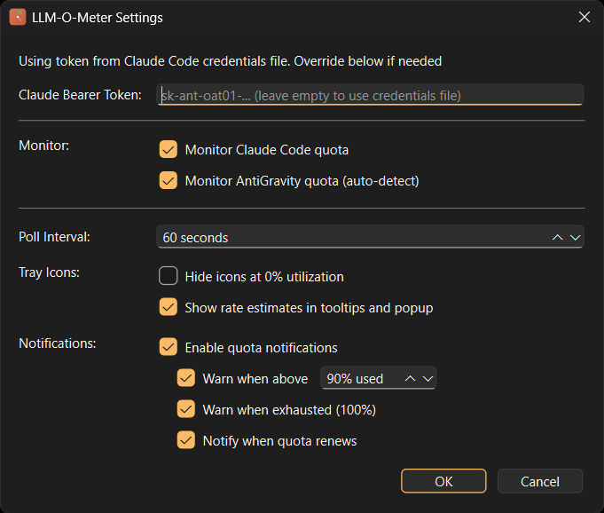

# LLM-O-Meter

<p align="center">  </p>
<p align="center">  </p>

A system tray application for Windows and macOS that monitors your quota usage in real-time.

Designed for Claude Code and Google AntiGravity users, LLM-O-Meter sits in your system tray and gives you at-a-glance visibility into your model usage quotas — before you hit a wall mid-task.

## Features

- **Live quota monitoring** — Polls the Claude API at a configurable interval (10–600 seconds) and updates tray icons instantly
- **AntiGravity support** — Detects a running AntiGravity language server and shows per-model quota alongside Claude quotas
- **Pie-chart tray icons** — Color-coded icons show utilization at a glance: green, amber, and red as you approach limits
- **Detailed popup** — Click any tray icon to open a draggable popup with progress bars, reset times, and rate estimates
- **Usage rate tracking** — Calculates how fast you're burning quota (% per hour) and predicts when it will be exhausted (experimental, enable it in settings window)
- **Desktop notifications** — Alerts you when utilization crosses a configurable threshold, when quota is exhausted, and when it renews
- **Automatic credential detection** — Watches `~/.claude/.credentials.json` and starts monitoring automatically when Claude Code credentials appear

## Screenshots
<p align="center"> Windows  </p>
<p align="center"> MacOS  </p>
<p align="center">  </p>
<p align="center">  </p>

## Requirements

| Component | Version |
|-----------|---------|
| Qt        | 6.10.1  |
| Compiler  | MinGW 13.1.0 64-bit (Windows) |
| CMake     | 3.16 or later |
| Ninja     | any recent version |

All of the above are installed by the [Qt Online Installer](https://www.qt.io/download-qt-installer). The default Qt install paths are expected:

- Qt: `C:\Qt\6.10.1\mingw_64`
- MinGW: `C:\Qt\Tools\mingw1310_64`
- Ninja: `C:\Qt\Tools\Ninja`

## Building on Windows

Run the provided batch script from the project root:

```bat
build_win.bat
```
The finished, distributable application is in `dist_win/` when the script completes successfully.

## Building on macOS

Requires [create-dmg](https://github.com/create-dmg/create-dmg) for packaging:

```sh
brew install create-dmg
```

Run the provided shell script from the project root:

```sh
./build_mac
```

Output goes to `build_mac/`, distribution to `dist_mac/`. The script also produces `dist_mac/LLM-O-Meter.dmg` ready for distribution.

## Configuration

Settings are stored in the OS-native settings store (registry on Windows, plist on macOS) and are accessible via **right-click tray icon → Settings**:

## Authentication

LLM-O-Meter reads the OAuth token that Claude Code writes to `~/.claude/.credentials.json`. If you are already using Claude Code, no manual configuration is needed — the app detects the file automatically and starts monitoring.

You can also enter a token manually in the Settings dialog.

## About

Made by [Brekel - brekel.com](https://brekel.com)
